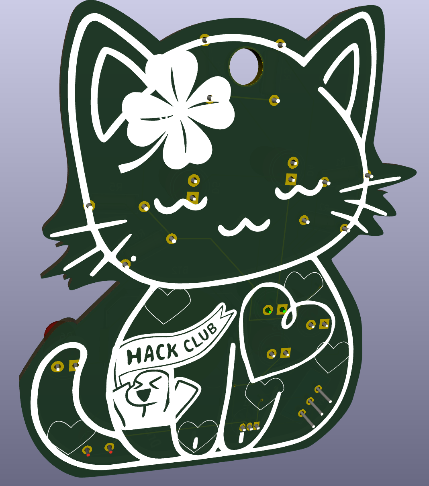

# DristiCatPCBSolder
Hello! Here is my PCB keychain for HC solder :D. It controls the LEDs using the potentiometer (as a variable resistor) and in response to the brightness level (with the photoresistor). This was my first time fully designing a PCB :D I'm looking forward to soldering it and using it on my bag.
Parts: (1) photoresistor, (1) potentiometer, (1) npn transistor, (6) LEDs, (6) 220ohm resistors and a battery cell.

Cat Image Attribution: <a href="https://www.vecteezy.com/free-vector/cat">Cat Vectors by Vecteezy, Posted by 
Arif Wahyu</a>

# PCB 3D VIEW

  
  

# PCB FOOTPRINTS AND SCHEMATIC

  

  

